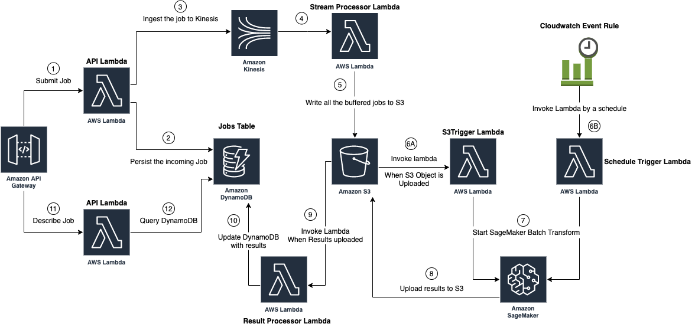

# Processing ML workloads asynchronously using a serverless infrastructure on AWS

Amazon SageMaker provides two primary ways to process ML Workloads in production. Synchronously using Amazon SageMaker Endpoints and asynchronously using Amazon SageMaker Batch Transform.

Using Amazon SageMaker Endpoints you can deploy your model to a custom environment in terms of copmute power and number of instances. Once your model is deployed, SageMaker Endpoints will provide you an API endpoint that you can call to submit your ML inference requests. The requests will be processed synchronously meaning that once a request is recieved it's processed right a way and the response is sent back to the caller of the API. This is a good solution in cases that a model needs to be served online and requires short response time.

While typically ML models are served synchronously, serving them asynchronously is suitable in scenarios where ML job is compute intensive and takes longer than a typical API response time to process and can negatively impacts user's experience to wait for the response after calling the API. Another use case is when high throughput and better resource utilization is important and there is some tolerance in terms of time to wait for collecting requests in batch before processing them. Processing the requests in batch in these scenarios can increase the resource utilization and lowers the infrastructure cost.

Amazon SageMaker Batch Transform provides a managed solution to process large datasets stored in S3 asynchronously and in batch. This processing can be anything from feature engineering and ETL jobs to inference using SageMaker models. Customers can point to their data located at Amazon S3, pick a custom or built-in Amazon SageMaker Algorithm, initiate their batch processing jobs and once the batch job is completed the results will be uploaded to a pre-specified S3 path in batch.

As mentioned earlier, the Amazon SageMaker Batch Transform interface for recieving the requests and returning the results is at the S3 level. What if we still want to receive the requests individually through an API endpoint like we do using SageMaker endpoints but instead of processing them synchronously, just collect them in batches and process them asynchronously? Using sageMaker Batch Transform all the results are uploaded in Batch to S3. What if we want to provide an API for users to query the result for a specific request among all the requests that are processed in batch? Luckily AWS provides other services that can be combined with SageMaker Batch Transform and address all these scenarios.

In this post we introduce a reference architecture and SAM (Serverless Application Model) template for a serverless infrastructure for processing ML workloads asynchronously while providing APIs to submit and track each individual request.

## Architecture Overview



### API Gateway
Amazon API Gateway provides the API interface for users to interact with the platform. It serves two APIs:

1- ```POST /job```
This API is used for submitting a new job. The API response includes ```job_id``` field used for tracking the submitted job.

2- ```GET /job/{job_id}```

This API is used for getting the status (and result if it's processed) for a specific job by ```job_id```.

Requests sent to API Gateway invoke the API Lambda. (Source code available at src/api directory).

### API Lambda: Job Submission
Once a job is submitted through the API, the API Lambda is invoked and perform the following:

1- Injest the submitted job to a Kinesis stream. 
2- Persist the job to a DynamoDB table so it can be tracked later.

### Kinesis Stream
The kinesis stream buffers the incoming request until it reaches a certain size or time window and then invokes the stream processor lambda with the buffered records. Both Kinesis batch size and time window can be configured through the input parameters when deploying the stack. 

### Stream Processor Lambda
Once the stream processor lambda is invoked it writes all the incoming records to S3 under a unique batch ID. (UUID V4 format). The S3 path is defined by convention and as ```data/[year]/[month]/[day]/[hour]/[minute]/[batch_id]/data```. Having the time as part of the S3 prefix enables us to Run the batch process for a specific data later.

### Batch Triggers

There are two ways that one or multiple batches on S3 can trigger a Sagemaker Batch Transform job. When deploying the SAM template it can be specified which mode to use through an input parameter.

**1- S3 Trigger:** In this mode the S3 Trigger Lambda (which starts the Batch Transform job) is invoked by upload of any input batch data to S3. (By Stream Processor Lambda). In other words whenever Kinesis stream flushes a batch, that batch is written to S3 and it invokes the S3 trigger lambda.

**2- Schedule Trigger:** In this mode the trigger is based on a scheduled rate. It can be yearly, monthy, daily, by hour or by minute. For example if it's set by hour then each hour it is trigerred and submits all the batches in the previous hour to SageMaker Batch Transform job.

