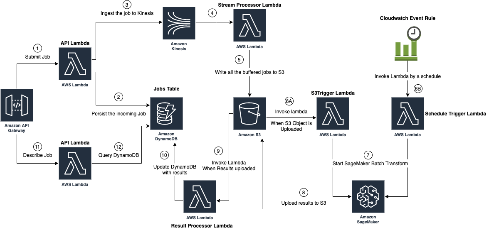

## Template for Processing ML Workloads asynchronously in Batch using SageMaker Batch Transform

AWS SAM (Serverless Application Model) template to spin up a serverless infrastructure on AWS for running Asycnhronous ML workloads (Inference or ETL) using SageMaker Batch Transform.

It provides two API endpoints, one for submitting jobs asynchronously and one for getting the results of a submitted Jobs. 
All the jobs are batched based on a parameterized threshold (time or job size based) and once they are uploaded to S3 in batch, it triggers a SageMaker Batch Transform job. 
Once results for the Batch Transform job are uploaded to the S3 bucket, it triggers a lambda to updates the DynamoDB with the results so users can query the result by a specific Job ID. 
Another mode to trigger the batch transform job is by a parameterized schedule.

This architecture provides the functionality to track the status of an individual record that is processed by SageMaker Batch Transform. 

### Architecture Diagaram




### Setting up the infrastructure

Build the template:
```bash
sam build
```

Deploy the template:
```bash
sam deploy --stack-name [Stack Name] --guided
```
Provide the value to the input parameters once prompted. List of input parameters and their description is available at the "Parameters" section of template.yaml file.

"ApiEndpoint" is printed as an output after deploying the SAM template and also can be found at the output section of the deployed stack. It indicates the API Endpoint.

"ApiKeyId" is printed as an output as well and it indicates the API Key ID (and not value).

Run the following command to get the value for the API Key:
```bash
aws apigateway get-api-key --api-key [API Key ID Here] --include-value 
```

When calling the API endpoint provide the API Key value as a header with the name "x-api-key".

For example:

```bash
curl [API Endpoint]/job/{job_id} -H "x-api-key: [API Key Value]"
```

## Security

See [CONTRIBUTING](CONTRIBUTING.md#security-issue-notifications) for more information.

## License

This library is licensed under the MIT-0 License. See the LICENSE file.
